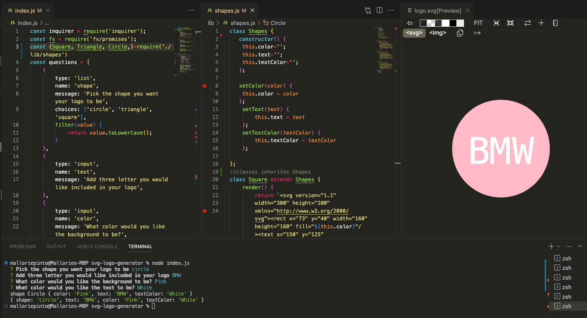

# SVG-Logo-Generator

## Description
This command line application will generate a simple log in a SVG file for the user. The user will be asked a series of questions that are required to build the logo. It will then generate the SVG file into the code editor automatically under the examples file once all the questions are answered. In order to build this command-line app, I used node.js first so that I was able to read the javascript outside of a browser. Installation indtructions are below.  Building this app also allowed me to practice javascript. The application also uses JEST to test the shapes. 

## Installation
To use, first be sure to install inquier by typing "npm i inquirer@8.2.4" into the terminal. Once the package.json is installed, type node index.js into the terminal. The prompt questions for your logo generator will begin. To conduct the JEST test type npm run test into the terminal.  

## Usage
Screen recording URL: https://drive.google.com/file/d/1MXmvBE2h4FgS28drh-6etTLL8XovFqZa/view

## License
No License